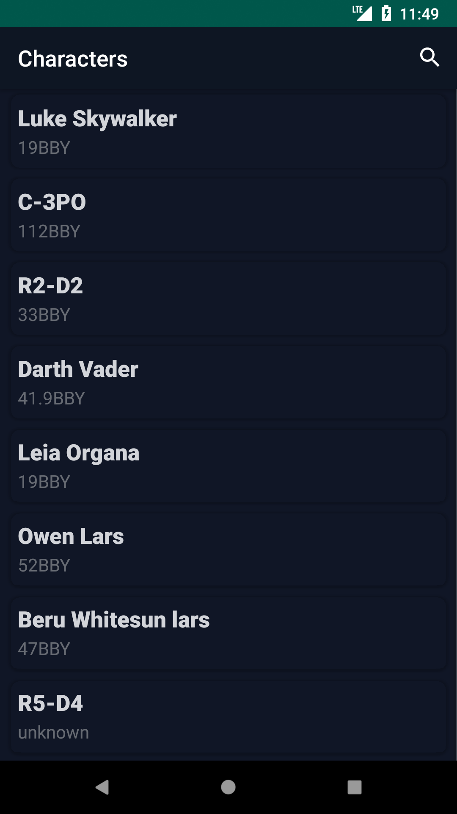
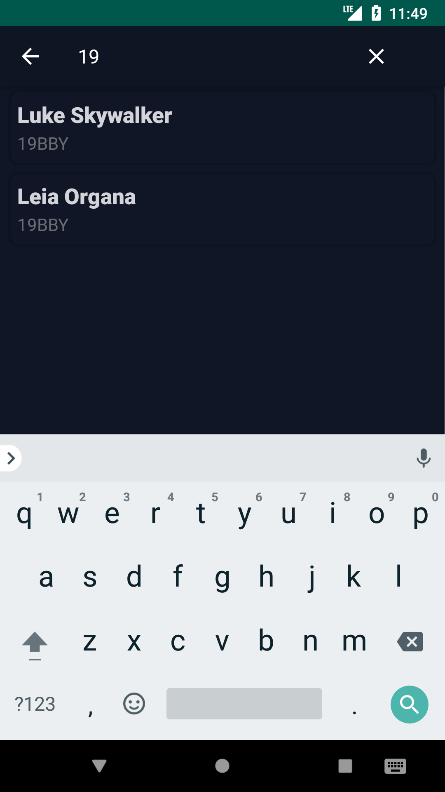
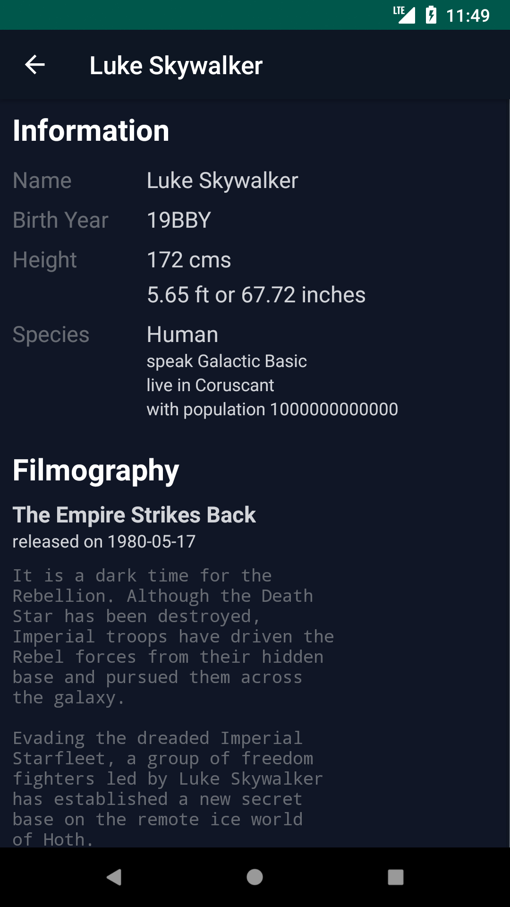
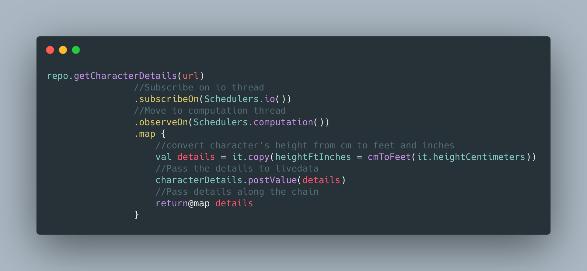
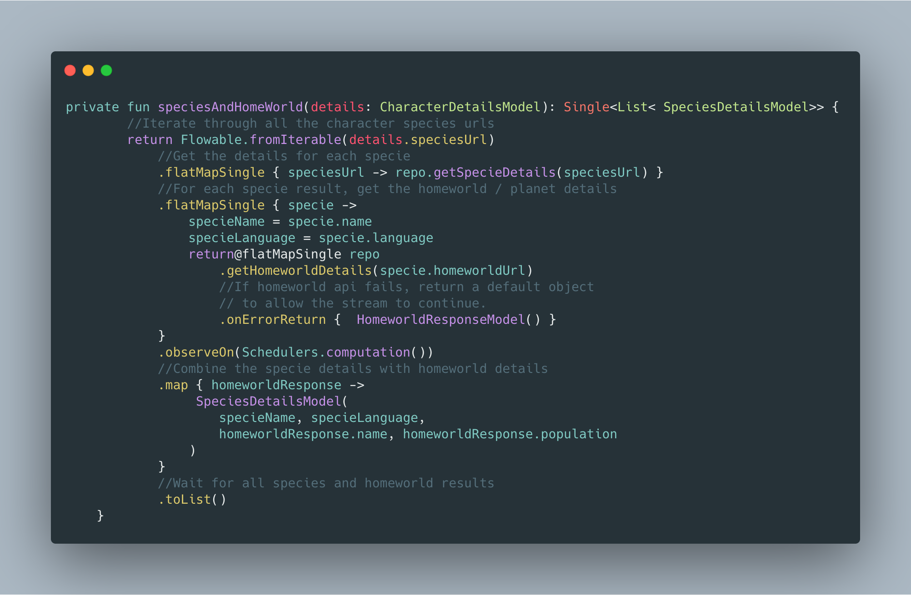
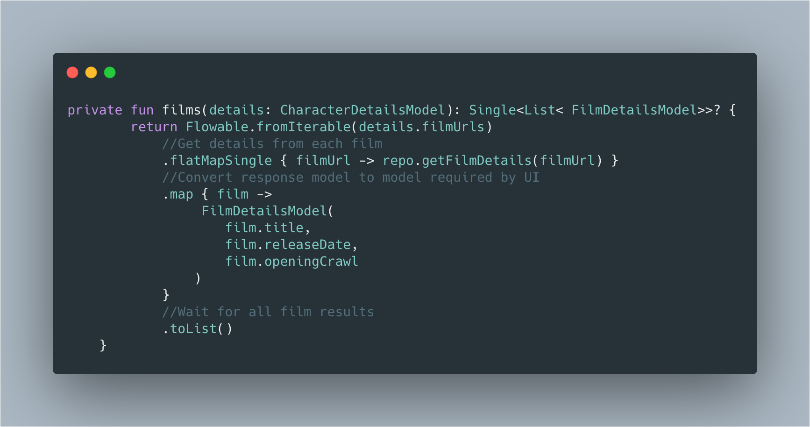
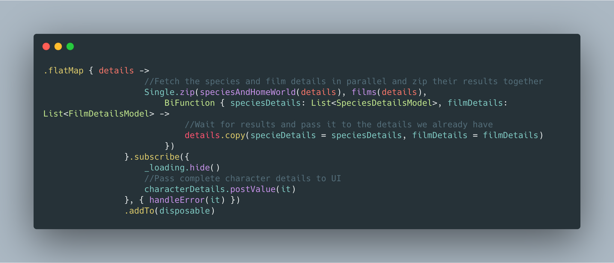
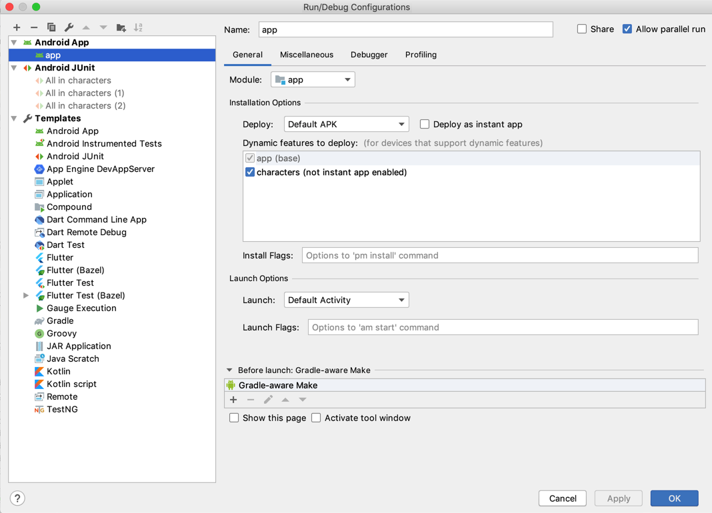

#  StarWars Android Challenge

This sample app has been developed with Kotlin following an MVVM architecture pattern with a modular approach for **[Challenge](challenge.txt)** given by Trivago.

# Working
* Home screen: List characters by fetching from SWAPI with pagination, scroll to load more characters. 
* Search by Name: Just enter name of character and press search button or wait. 
* Search by Birth Year: Just enter year in digits. 
* Details screen: List down character details by fetching from SWAPI.

<p align="center">
  
  
  
  
</p>
<br>
<br>


### Framework
* **[Koin](https://github.com/InsertKoinIO/koin)**: Dependency injection
* **[Reactive streams](https://github.com/ReactiveX/RxJava)**: Networking & Async.
* **[LiveData and ViewModel](https://developer.android.com/topic/libraries/architecture)**: Isolate business logic and maintain state.


### Decisions
* **Koin**: Koin is a simple powerful Dependency injection framework for Kotlin. Written in pure Kotlin using functional resolution only: no proxy, no code generation, no reflection!

* **Modular**: The app is developed with a modular approach to support following:

  * Faster gradle builds
  * Re-usability of common functionality across applications / modules
  * Easily pluggable into Instant apps
  * Better team work, as one person can have the sole responsibility of a module
  * Smoother git flows


# Project Structure
* `app` module is where the application initialises.
* `characters` dynamic module is where our sample screens reside. 
* `CharacterActivity` holds the `CharacterSearchFragment` & `CharacterDetailsFragment`.
* The packages are created using MVVM pattern.


## The chain
Used SWAPI service to build the following chain:
* Hit the `/people/{id/}` for a particular character. This response would give you multiple `/species/{id}/` urls and multiple `/films/{id}/` urls.
* Fetch the specie details from each `/species/{id}/`. These details would also contain a `/planets/{id}/` url, hit this and get the planet details.
* Fetch the film details from each `/films/{id}/` url.
* Combine the responses of `/people/{id}/`, multiple `/species/{id}/`, `/planets/{id}/` & multiple `/films/{id}/` into a model.


### Considerations
Some species may not have a planet. This should not break the chain.
Try to run the species + planets and films fetch in parallel.

## The Rx Chain

**1. Get basic details**


**2(a). Get species & planets details from basic details**


**2(b). Get film details from basic details**


**3. Merge species, planets and film details to basic details and send to UI**



# Running
You will need a device / emulator with Android Oreo (API 27) and up.


# Testing
Test cases for the [`CharacterSearchVM`](characters/src/test/java/com/karntrehan/starwars/characters/search/CharacterSearchVMTest.kt) & [`CharacterDetailsVM`](characters/src/test/java/com/karntrehan/starwars/characters/details/CharacterDetailsVMTest.kt) have been implemented using 
* `junit` : A unit testing framework
* `robolectric` : A framework that brings fast and reliable unit tests to Android. 
* `mockitoKotlin` : A small library that provides helper functions to work with Mockito in Kotlin.
* `aacTesting` : Test helpers for LiveData

## Library reference resources:
1. SWAPI: [https://swapi.co](https://swapi.co)
2. Koin: [https://github.com/InsertKoinIO/koin](https://github.com/InsertKoinIO/koin)
3.  Retrofit:[https://square.github.io/retrofit](https://square.github.io/retrofit/)
4. RxJava2: [https://github.com/ReactiveX/RxJava](https://github.com/ReactiveX/RxJava)
5. mockito-kotlin: [https://github.com/nhaarman/mockito-kotlin](https://github.com/nhaarman/mockito-kotlin)
6. Robolectric: [https://github.com/robolectric/robolectric](https://github.com/robolectric/robolectric)
7. Joda-time: [https://github.com/JodaOrg/joda-time](https://github.com/JodaOrg/joda-time)

## Credits
1. [Carbon](https://carbon.now.sh): Used to create beautiful images of source code.
2. [Convertio](https://convertio.co/mov-gif/): Used to convert app usage video to gif file. 


## License
```
Licensed under the Apache License, Version 2.0
```